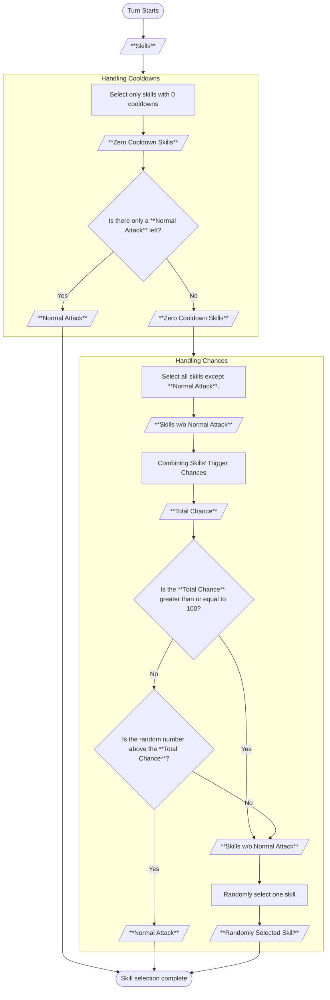

# Adventure

Adventure content is available to players as a first step in developing their avatars. For a detailed description of Adventure content, see the [official documentation](https://docs.nine-chronicles.com/introduction/intro/game-contents/adventure).

## World

The adventures of the Nine Chronicles begin in Yggdrasil, and there are new worlds after that, in the following order: Alfheim, Svartalfheim, Asgard, and so on. This data comes from the `WorldSheet`.

- [Nekoyume.TableData.WorldSheet](https://github.com/planetarium/lib9c/blob/1.17.3/Lib9c/TableData/WorldAndStage/WorldSheet.cs)

You can use the 9c-board service to view the `WorldSheet`.

- https://9c-board.nine-chronicles.dev/odin/tablesheet/WorldSheet
- https://9c-board.nine-chronicles.dev/heimdall/tablesheet/WorldSheet

Yggdrasil, where you begin your adventure, is open when you create your avatar. Subsequent worlds are unlocked by meeting certain conditions. More information can be found in the `WorldUnlockSheet`.

- [Nekoyume.TableData.WorldUnlockSheet](https://github.com/planetarium/lib9c/blob/1.17.3/Lib9c/TableData/WorldAndStage/WorldUnlockSheet.cs)

Like `WorldSheet`, you can check it out in 9c-board.

- https://9c-board.nine-chronicles.dev/odin/tablesheet/WorldUnlockSheet
- https://9c-board.nine-chronicles.dev/heimdall/tablesheet/WorldUnlockSheet

## Stage Challenges and Rewards

Each world contains multiple stages, each with different rewards for completing them. Stage information can be found in the `StageSheet`.

- [Nekoyume.TableData.StageSheet](https://github.com/planetarium/lib9c/blob/1.17.3/Lib9c/TableData/WorldAndStage/StageSheet.cs)
- https://9c-board.nine-chronicles.dev/odin/tablesheet/StageSheet
- https://9c-board.nine-chronicles.dev/heimdall/tablesheet/StageSheet

### Stage Challenge Cost

When you look at the `StageSheet`, there is a field called `CostAP`. This field represents the number of action points required to progress through the stage. Players can spend [their avatar's action points](https://nine-chronicles.dev/modding/system-guide/1-transaction-and-action) to progress through the adventure.

## Stage Waves

A stage consists of several waves, each of which must be cleared before moving on to the next wave. Wave information can be found in the `StageWaveSheet`.

- [Nekoyume.TableData.StageWaveSheet](https://github.com/planetarium/lib9c/blob/1.17.3/Lib9c/TableData/WorldAndStage/StageWaveSheet.cs)
- https://9c-board.nine-chronicles.dev/odin/tablesheet/StageWaveSheet
- https://9c-board.nine-chronicles.dev/heimdall/tablesheet/StageWaveSheet

Nine Chronicles currently has all stages set to three waves. The number of waves your avatar completes determines the number of stars you earn in the stage. The number of stars also determines the rewards, as shown below.

- 1 star: EXP
- 2 stars: EXP, items
- 3 stars: EXP, items, unlock next stage

## Stage Buff

Stage buffs are buffs that the player can receive when progressing through a particular stage. These buffs can be found in the `CrystalRandomBuffSheet` and `CrystalStageBuffGachaSheet`.

- [Nekoyume.TableData.Crystal.CrystalRandomBuffSheet](https://github.com/planetarium/lib9c/blob/1.17.3/Lib9c/TableData/Crystal/CrystalRandomBuffSheet.cs)
- [Nekoyume.TableData.Crystal.CrystalStageBuffGachaSheet](https://github.com/planetarium/lib9c/blob/1.17.3/Lib9c/TableData/Crystal/CrystalStageBuffGachaSheet.cs)

## Item Slots

There are item slots available to you as you progress through your adventure. You can equip different items in these slots to give you an advantage in combat. 
Items that can be used in an adventure include equipment, costumes, and food.

## Rune Slots

As you progress through your adventure, you can equip runes to gain various effects.

## Repeat Battle

Adventures can be repeated, and AP potions can be used to do so.

## Battle(StageSimulator)

Battle is turn-based, and players can use various items with their avatars to defeat enemies. Adventures utilize the [StageSimulator](https://github.com/planetarium/lib9c/blob/1.17.3/Lib9c/Battle/StageSimulator.cs) class to run battle. This class manages the flow of battle and handles the events that occur on each turn.

When a battle begins, it creates a player avatar.

- [Nekoyume.Model.BattleStatus.SpawnPlayer](https://github.com/planetarium/lib9c/blob/1.17.3/Lib9c/Model/BattleStatus/SpawnPlayer.cs)

### Wave

When a battle starts, the first wave begins. If you don't clear the wave, the battle ends, if you do, you move on to the next wave, and if you clear the last wave, the battle ends.

- [Nekoyume.Model.BattleStatus.SpawnWave](https://github.com/planetarium/lib9c/blob/1.17.3/Lib9c/Model/BattleStatus/SpawnWave.cs)

### Turn

When a wave starts, a formula is used to give the highest priority character a turn, which is determined by the character's SPD(Speed) stat.

1. Wave starts.
2. The player avatar has a priority of **100[^simulator-turn-priority] / avatar's SPD stat**. The number `100` in the above formula, is the value used in the formula for determining turn priority in the simulator and can be found in [Nekoyume.Battle.Simulator.TurnPriority](https://github.com/planetarium/lib9c/blob/1.17.3/Lib9c/Battle/Simulator.cs#L21).
3. All enemies in the wave have a priority of **100 / enemy's SPD stat**.
4. Give the turn to the character with the highest priority, i.e., the smallest **100 / SPD stat**.
5. The character granted a turn in (4) takes the turn.
6. Increase the priority of characters that were not granted a turn in (4).
   - Multiply by `0.9` if the character is a player and used a non-Basic Attack skill in the previous turn.
   - Otherwise, multiply by `0.6`.
7. Characters granted a turn in (4) again have a priority of **100 / character SPD stat**.
8. Repeat steps (2) through (7) until the player avatar dies or the wave is cleared.
9. Wave ends. Repeat from (1) for the next wave if one exists.

### Skill Activation

All characters, including avatars and enemies, can activate skills. Skills include a variety of offensive and buff skills, including **Normal Attack**. Which skill is activated is determined by the activation chance of each skill.

::: details Skill Activation Flowchart

:::

**Skill Types**

- [Nekoyume.Model.BattleStatus.NormalAttack](https://github.com/planetarium/lib9c/blob/1.17.3/Lib9c/Model/BattleStatus/NormalAttack.cs): This is the **Normal Attack**.
- [Nekoyume.Model.BattleStatus.BlowAttack](https://github.com/planetarium/lib9c/blob/1.17.3/Lib9c/Model/BattleStatus/BlowAttack.cs)
- [Nekoyume.Model.BattleStatus.DoubleAttack](https://github.com/planetarium/lib9c/blob/1.17.3/Lib9c/Model/BattleStatus/DoubleAttack.cs)
- [Nekoyume.Model.BattleStatus.DoubleAttackWithCombo](https://github.com/planetarium/lib9c/blob/1.17.3/Lib9c/Model/BattleStatus/DoubleAttackWithCombo.cs)
- [Nekoyume.Model.BattleStatus.AreaAttack](https://github.com/planetarium/lib9c/blob/1.17.3/Lib9c/Model/BattleStatus/AreaAttack.cs)
- [Nekoyume.Model.BattleStatus.BuffSkill](https://github.com/planetarium/lib9c/blob/1.17.3/Lib9c/Model/BattleStatus/BuffSkill.cs)
- [Nekoyume.Model.BattleStatus.HealSkill](https://github.com/planetarium/lib9c/blob/1.17.3/Lib9c/Model/BattleStatus/HealSkill.cs)
- [Nekoyume.Model.BattleStatus.BuffRemovalAttack](https://github.com/planetarium/lib9c/blob/1.17.3/Lib9c/Model/BattleStatus/BuffRemovalAttack.cs)
- ...

### Normal Attack Hits

Normal Attack is also treated as skills in Nine Chronicles, and whether or not they hit is largely determined by the attacker's and defender's levels and HIT stats, with a few other formulas.

- In the [Nekoyume.Model.Skill.AttackSkill.ProcessDamage](https://github.com/planetarium/lib9c/blob/1.17.3/Lib9c/Model/Skill/AttackSkill.cs#L62) method, get the hit status of the **Normal Attack**: `target.IsHit(caster)`.
- The `IsHit` method above points to [Nekoyume.Model.CharacterBase.IsHit(CharacterBase)](https://github.com/planetarium/lib9c/blob/1.17.3/Lib9c/Model/Character/CharacterBase.cs#L508), which is overridden by the player character ([Nekoyume.Model.Player](https://github.com/planetarium/lib9c/blob/1.17.3/Lib9c/Model/Character/Player.cs)) and so on.
- A quick look at the logic of hits in adventures:
   - When the defender is a player character, they cannot dodge an attacker's attack.
   - If the attacker is under the effect of a Focus buff([Nekoyume.Model.Buff.Focus](https://github.com/planetarium/lib9c/blob/1.17.3/Lib9c/Model/Buff/Focus.cs)), it will hit 100% of the time.
      - Otherwise, the hit is handled according to the result of the [Nekoyume.Battle.HitHelper.IsHit](https://github.com/planetarium/lib9c/blob/1.17.3/Lib9c/Battle/HitHelper.cs#L23) method.

**Nekoyume.Battle.HitHelper.IsHit**

1. Get a value `A` between `-5 ~ 50` with `(attacker's level - defender's level)`.
2. Use `(Attacker's HIT stat * 10000 - Defender's HIT stat * 10000 / 3) / Defender's HIT stat / 100` to get a value `B` between `0 ~ 50`.
   - If the attacker's and defender's HIT stats are less than or equal to 0, then it is scaled by 1.
3. Use `A + B` to get a value `C` between `10 ~ 90`.
4. Find a random number `D` between `0 ~ 99`.
5. finally, if `C` is greater than or equal to `D`, treat it as a hit.

### Combo

Avatar's attacks can have combo effects.

- The maximum number of combos depends on the avatar's level. For example, at level 1, you can get up to 2 combos, and at level 250, you can get up to 5 combos.
- If you fulfill the [combo increase condition](#increase-combo) after getting the maximum combo, you will start with 1 combo.

#### Increase Combo

- Successfully executes a normal attack.
- Successfully executes a skill with the `SkillSheet.Combo` field set to `true`.

#### Reset Combo

- Normal attack fails.

#### Combo Effect

- Increases the damage of normal attack or skills with a `SkillSheet.Combo` field of `true`.
   - [Nekoyume.Model.CharacterBase.GetDamage](https://github.com/planetarium/lib9c/blob/1.17.3/Lib9c/Model/Character/CharacterBase.cs#L524)
   - [Nekoyume.Battle.AttackCountHelper.GetDamageMultiplier](https://github.com/planetarium/lib9c/blob/1.17.3/Lib9c/Battle/AttackCountHelper.cs#L23)
- Gain additional critical chance based on a condition.
   - [Nekoyume.Model.CharacterBase.IsCritical](https://github.com/planetarium/lib9c/blob/1.17.3/Lib9c/Model/Character/CharacterBase.cs#L490)
   - [Nekoyume.Battle.AttackCountHelper.GetAdditionalCriticalChance](https://github.com/planetarium/lib9c/blob/1.17.3/Lib9c/Battle/AttackCountHelper.cs#L37)

## Related actions

A list of actions associated with Adventure content:

- [DailyReward](https://github.com/planetarium/lib9c/blob/1.17.3/Lib9c/Action/DailyReward.cs): You get the action points you need to execute the action.
- [HackAndSlash](https://github.com/planetarium/lib9c/blob/1.17.3/Lib9c/Action/HackAndSlash.cs): The default adventure action.
- [HackAndSlashSweep](https://github.com/planetarium/lib9c/blob/1.17.3/Lib9c/Action/HackAndSlashSweep.cs): This action clears stages with 3 stars.
